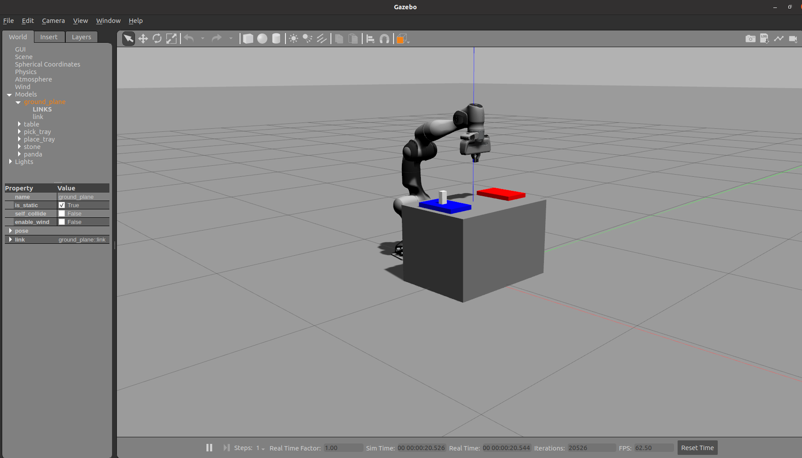

# franka_LfD

Copyright (C) 2024, by Youssef Michel.

The project provides a Learning-from-Demonstration (LfD) interface for controlling a franka robot. The demonstrations are to be provided by the logitech F710 wireless gamepad https://amzn.eu/d/7D5hGVi 
.Subsequently, the provided demonstrations are segmented and encoded to learn a task model consisting of several primitves, which are eventually executed on the robot. 

## Setting up: 

- Since the project depends on the franka robot, we need to install the `franka_ros` package. For more details, please check https://frankaemika.github.io/docs/installation_linux.html  

- We also need the ros package for reading the joystick commands: https://github.com/ros-drivers/joystick_drivers.git . We only need the `joy` package, so make sure it is in the `/catkin_ws/src`. 
 

- Finally, we can clone the `franka_LfD` into our workspace and `caktin_make` to build  

## Demonstration Phase:

- Once everything is set up, we can start providing demonstrations to the robot using the joystick. From the joystick, we have full access over the robot control. This includes:
  - Right joystick: control in y,z translation directions. 
  - Left joystick: rotations around y,z (commanded to the robot as unit quaternions)
  - RT/LT: control the robot in the +/-ve x-axis (translation)
  - X/B buttons: opening and closing of gripper. 
 - Alternatively, we can also control the robot via the interactive marker. Simply drag the robot from the arrows to move it around. 
 -  To start, first we have to launch our robot in gazebo (the command below launches the robot in a world with an object that can be grasped): 
 ```
 roslaunch franka_gazebo panda.launch rviz:=false world:=$(rospack find franka_gazebo)/world/stone.sdf x:=-0.5
  ```
- You should see the following: 

<p float="center">
  
</p>

- Once we see the robot in gazebo, we can roslaunch our package to provide the demos. The interface should be set to "joy" (joystick) or "marker" (interactive marker): 
```
  roslaunch franka_LfD franka_lfd.launch mode:=tele interface:=joy
```

- There you go, you can start moving your robot around !

- To check the generate motion profiles, they are saved in `rob_pose_actual.txt` (actual pos, first three columns) and `rob_pose_quat_demo.txt`(unit quaternions, and angular velocity)

## Learning: 

- To learn the task model, simply run the script `skill_learning_grasp.py` in `/scripts`, which reads the demonstrated trajectory from file, segments them, and learns a task model, consiting essentially from a sequence of the primitives: `move`, `open gripper` and `close gripper`  

- The motions are learned (both positions and orientations) using locally weighted regression.

- a DMP implemntation is also available both for positions and orientations.

- N.B: Since we rely on the gripper actions to segment the task, please make sure to avoid controlling the gripper while also moving the robot. 

## Control: 

- Once the skill is learnt, if you wish to see the robot execute it, launch the robot in gazebo (same as before), and then use: 
```
roslaunch franka_LfD franka_lfd.launch mode:=auto
```
- The cartesian space controller then tracks the desired motion. A null space controller attempts to put the robt in configurations with high manipubablity via self motions of the elbow

